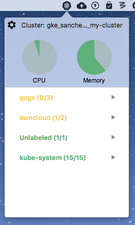

# KubeMonitor

### About KubeMonitor
KubeMonitor is an OS X app that displays information about your active Kubernetes cluster 
in your menu bar. Internally, it polls the `kubectl` command to gather information about
running pods and nodes, and displays it in a more user-friendly way

---

  

### Features
- Display a list of pods
  - pods can be grouped by a label, to make organization easier
  - pods/groups are color-coded based on current state
- View resource usage of your cluster
  - resource information from individual pods and nodes is compiled into pie charts that 
  show the health of the cluster
  - information can also be viewed for pods or groups of pods using tooltips
- Directly connect to a node or container
  - a terminal prompt can be opened to automatically SSH into the node a pod lives on
  - additionally, you can connect directly into a container by launching a terminal with a 
  `kubectl exec` session
- Delete active pods
  - pods can quickly be killed through the GUI
- View the current cluster
  - the cluster name is displayed at the top of the window, making switching between clusters
  less confusing

### Dependencies
- `kubectl` is required in order to get information about the cluster
  - By default, KubeMonitor will look for the command in `~/Documents/google-cloud-sdk/bin/`, 
  but the path can be changed in the app's settings
- Applescript is required to launch a terminal session, but this should come installed by default
- Connecting an SSH session to a node requires keys for authentication. If Google Cloud is
being used, these keys should be found at `~/.ssh/google_compute_engine`

### Third Party Libraries
- This project makes use of [Core Plot](https://github.com/core-plot/core-plot) through [CocoaPods](https://cocoapods.org/)

---
**This is not an official Google product**
